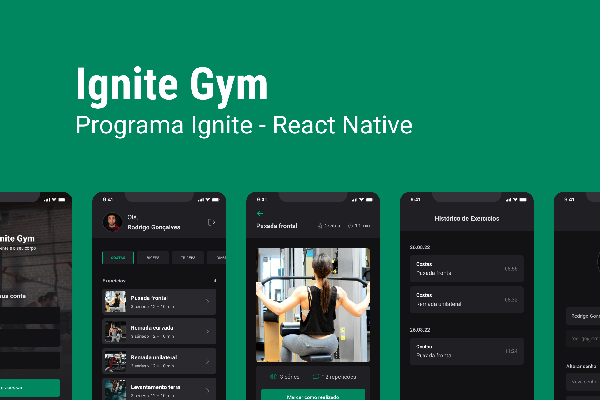

# Ignite Gym

  

## Sobre o Projeto

O Ignite Gym é uma aplicação para você gerenciar seus treinos na academia e ter mais controle sobre os exercícios que está realizando. A Aplicação consome um back-end em Node.js que contém uma variedade de exercícios divididos em categorias, de modo que você pode filtrar pela categoria e então acessar o exercício desejado para receber a recomendação de quantas séries realizar. Após realizar um exercício você pode marcá-lo como realizado, e então ele ficará salvo em seu histórico.

A aplicação conta com um sistema de cadastro de usuários 100% funcional, fazendo uso de tokens de autenticação, onde você pode gerenciar a sua senha e o seu avatar.

Além disso, toda ela funciona com o uso do Async Storage, ou seja, se você fechar a aplicação os dados que inseriu nela estarão lá na próxima vez que você abri-la.

## Como Rodar o Projeto

Para rodar o projeto, você deve clonar o repositório em sua máquina e então rodar o comando `yarn` para instalar todas as dependências. Após isso, você deve rodar o comando `yarn start` para iniciar a aplicação.

Made with 💜 by Nunees
